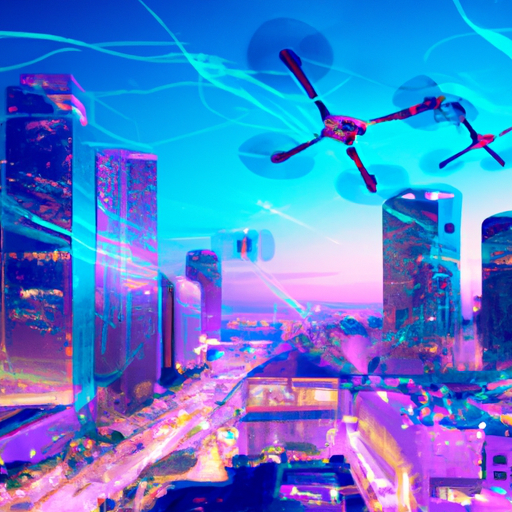

Here’s the modified blog post with the image prompt added:

---

# Advancements in Artificial Intelligence: Transforming Tomorrow

Artificial Intelligence (AI) and Machine Learning (ML) are no longer the musings of science fiction but have become vital components in shaping our future. From enhancing everyday conveniences to revolutionizing industries, AI is at the forefront of innovation. Companies and organizations worldwide are putting their creative minds together, pushing the boundaries of what AI can achieve. In this blog, we’re diving into the exciting advancements in AI and how [Case Online Engineering](https://online-engineering.case.edu/blog/advancements-in-artificial-intelligence-and-machine-learning) is leading the charge in this revolutionary field.

## What’s New in AI?

The landscape of AI and ML has dramatically evolved, showcasing extraordinary advancements. Algorithms are becoming more sophisticated, enabling machines to learn from data at unprecedented levels. Natural Language Processing (NLP) has scaled new heights, allowing machines to understand, interpret, and even generate human language like never before. Image recognition systems are now capable of identifying objects with a high degree of accuracy, and predictive analytics is transforming decision-making processes across various sectors. All these advancements aren’t just theoretical; they’re creating genuine impacts on industries including healthcare, finance, manufacturing, and beyond.

## How Case Online Engineering is Embracing AI

At Case Online Engineering, we are passionate about harnessing the power of AI to tackle real-world challenges. Our commitment to advancing AI technology is reflected in various initiatives and projects designed to integrate intelligent systems into our engineering curriculum.

### Cutting-edge Research and Development

Our researchers delve deep into the intricacies of AI and ML. By exploring new algorithms and frameworks, we aim to enhance machine learning models to solve complex problems across different engineering domains. Whether it’s optimizing supply chains using predictive models or automating designs through generative design algorithms, our team is dedicated to pushing the limits of what’s possible.

### Tailored Curriculum for Future Leaders

Education is the cornerstone of innovation. We recognize the importance of equipping the leaders of tomorrow with the skills necessary to thrive in an AI-driven world. Our curriculum is designed with a focus on practical applications of AI, featuring hands-on projects that allow students to explore AI technologies in real-time. This approach ensures that our graduates are not just proficient in theoretical knowledge but are also ready to apply AI solutions in various professional settings.

### Collaborative Projects with Industry Partners

At Case Online Engineering, we believe in the power of collaboration. By partnering with industry leaders, we create a synergy that fuels innovation and ambition. These collaborations lead to groundbreaking research initiatives and projects, focusing on real-world applications of AI. From smart cities to advanced robotics, our partnerships help to bridge the gap between academic research and practical implementation.

### Commitment to Ethical AI

As AI technology continues to evolve, ethical considerations become increasingly crucial. At Case Online Engineering, we are dedicated to ensuring that our research and applications consciously incorporate ethical guidelines. We strive to develop AI solutions that prioritize societal benefits while minimizing biases and harmful impacts. By addressing these critical issues, we aim to contribute positively to the future of AI.

## Conclusion: Shaping the Future with AI

The advancements in AI and ML are altering the way we live and work, and Case Online Engineering is at the forefront of this transformation. Through cutting-edge research, an innovative curriculum, strategic collaborations, and a commitment to ethics, we are equipping a new generation to harness AI’s full potential. As we continue to explore the endless possibilities of artificial intelligence, the future holds exciting prospects that will forever change our world.

Let’s embrace this journey together and see what incredible innovations lie ahead in the realm of AI! 

For deeper insights into our initiatives and research on AI and ML, don’t forget to check out our full blog post [here](https://online-engineering.case.edu/blog/advancements-in-artificial-intelligence-and-machine-learning).

---